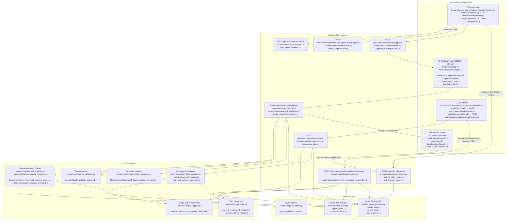

# Application Flow (Upload → Review → Validation → Final Report)

This document describes the end-to-end UX and backend execution flow for the Mamad Validation App.

- Frontend: React/Vite
- Backend: FastAPI
- Storage: Azure Blob Storage + Azure Cosmos DB
- AI: Azure OpenAI (vision)

## End-to-end flow (Mermaid)



## Code executed per step (real imports + entrypoints)

### 1) Upload

**Frontend (React)**

Source: `frontend/src/components/DecompositionUpload.tsx`

Calls one of:
- `POST /api/v1/decomposition/analyze`
- `POST /api/v1/decomposition/upload-segments`

**Backend (FastAPI)**

Source: `src/api/routes/decomposition.py`

Key imports (top of file):

```python
from src.services.segment_analyzer import SegmentAnalyzer
from src.services.plan_decomposition import get_decomposition_service
from src.azure import get_cosmos_client
from src.azure.blob_client import get_blob_client
from src.utils.image_cropper import get_image_cropper
```

Folder upload (PDF + images) uses local imports inside `create_decomposition_from_uploaded_segments(...)`:

```python
from src.utils.file_converter import convert_to_image_if_needed
from PIL import Image
```

### 2) Review

**Frontend (React)**

Source: `frontend/src/components/DecompositionReview.tsx`

Loads decomposition + images via:
- `GET /api/v1/decomposition/{id}`
- `GET /api/v1/decomposition/{id}/images/...`

Approves segments via:
- `POST /api/v1/decomposition/{id}/approve`

### 3) Validation (streaming)

**Frontend (React)**

Source: `frontend/src/App.tsx`

The streaming reader is implemented using a `fetch()` + `ReadableStream` loop:

```ts
// frontend/src/App.tsx
// - handleApprovalComplete(...)
// - fetch('/api/v1/segments/validate-segments-stream')
// - reader.read() loop parses NDJSON events
```

**Backend (FastAPI)**

Source: `src/api/routes/segment_validation.py`

Key imports used by the streaming endpoint:

```python
from fastapi.responses import StreamingResponse

from src.azure import get_cosmos_client, get_openai_client
from src.services.segment_analyzer import get_segment_analyzer
from src.services.mamad_validator import get_mamad_validator
from src.services.requirements_coverage import get_coverage_tracker
```

### 4) Per-segment AI analysis + rule validation

**AI extraction (vision)**

Source: `src/services/segment_analyzer.py`

```python
from PIL import Image

from src.azure import get_openai_client, get_blob_client

class SegmentAnalyzer:
  async def analyze_segment(...):
    image_bytes = await self._download_segment_image(segment_blob_url)
    extracted_data = await self._analyze_with_gpt(image_bytes=image_bytes, ...)
```

**Rules validation**

Source: `src/services/mamad_validator.py`

Entry point:
- `MamadValidator.validate_segment(...)`

### 5) Final report (client-side)

Source: `frontend/src/App.tsx`

- `openPrintableReport()` builds an HTML report and calls `window.print()`.
- `downloadJsonReport()` serializes the final results to JSON and triggers a download.


## Notes

- Folder upload currently supports **images + PDF**. Autodesk formats (DWF/DWFX/DWG) are intentionally not supported in this flow.
- The “Final Report” is generated client-side by `openPrintableReport()` (HTML + `window.print()`), and it embeds images via same-origin backend endpoints.
